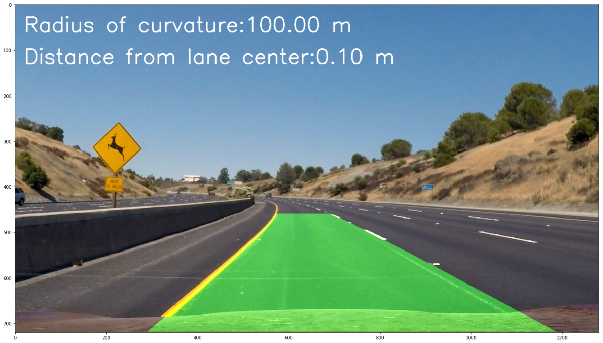

## Advanced Lane Finding

### Summary
The goals / steps of this project were the following:
* Compute the camera calibration matrix and distortion coefficients given a set of chessboard images.
* Apply a distortion correction to raw images.
* Use color transforms, gradients, etc., to create a thresholded binary image.
* Apply a perspective transform to rectify binary image ("birds-eye view").
* Detect lane pixels and fit to find the lane boundary.
* Determine the curvature of the lane and vehicle position with respect to center.
* Warp the detected lane boundaries back onto the original image.
* Output visual display of the lane boundaries and numerical estimation of lane curvature and vehicle position.

The images for camera calibration are stored in the folder called camera_cal. The images in test_images are for testing the pipeline on single frames.

[//]: # (Image References)

[image1]: ./examples/undistort_output.png "Undistorted"
[image2]: ./test_images/test1.jpg "Road Transformed"
[image3]: ./3.png "Binary Example"
[image4]: ./4.png "Warp Example"
[image5]: ./5.png "Fit Visual"
[image6]: ./examples/example_output.jpg "Output"
[video1]: ./project_video.mp4 "Video"
[image7]: ./mask.png "Mask"

### Camera calibration
The code for this step is contained in the first code cell of the IPython notebook located in "P2.ipynb".

I start by preparing "object points", which will be the (x, y, z) coordinates of the chessboard corners in the world. Here I am assuming the chessboard is fixed on the (x, y) plane at z=0, such that the object points are the same for each calibration image. Thus, objp is just a replicated array of coordinates, and objpoints will be appended with a copy of it every time I successfully detect all chessboard corners in a test image. imgpoints will be appended with the (x, y) pixel position of each of the corners in the image plane with each successful chessboard detection.

### Apply a distortion correction
I then used the output objpoints and imgpoints to compute the camera calibration and distortion coefficients using the cv2.calibrateCamera() function. I applied this distortion correction to the test image using the cv2.undistort() function and obtained this result:

![alt text][image1]

### Use color transforms, gradients, etc

So I complete all suggetions mentioned in the course.
I converted image to HLS color space and separates L and S channels

    hls = cv2.cvtColor(dstimg, cv2.COLOR_RGB2HLS)
    l_channel = hls[:,:,1]
    s_channel = hls[:,:,2]
    
Then applied Sobel operator, to eliminate horizontal lines. 

    # Sobel x
    sobelx = cv2.Sobel(l_channel, cv2.CV_64F, 1, 0) # Take the derivative in x
    abs_sobelx = np.absolute(sobelx) # Absolute x derivative to accentuate lines away from horizontal
    scaled_sobel = np.uint8(255*abs_sobelx/np.max(abs_sobelx))

    # Threshold x gradient
    sxbinary = np.zeros_like(scaled_sobel)
    sxbinary[(scaled_sobel >= 30) & (scaled_sobel <= 255)] = 1
    
Played with color thresholds.

    # Threshold color channel
    s_binary = np.zeros_like(s_channel)
    s_binary[(s_channel >= 150) & (s_channel <= 255)] = 1
    
At the end combined binary images.

    # Combine the two binary thresholds
    combined_binary = np.zeros_like(sxbinary)
    combined_binary[(s_binary == 1) | (sxbinary 
    
![alt text][image3]

Then i applied mask to hide some usless for lane detection areas

![alt text][image7]

### Perspective transform

Just applied cv2 method to transform image with matrix generated above.

    binary_warped = cv2.warpPerspective(combined_binary, M, img_size, flags=cv2.INTER_LINEAR)

![alt text][image4]

### Detecting lane pixels and finding the lane boundary

In step 5 we are passing the warped/top down view of the road binary image to the function "fit_polynomial", to determine the actual curve / lane lines.

    left_fit_p, right_fit_p, left_curverad, right_curverad, left_fit_m, right_fit_m = fit_polynomial(binary_warped)

The function fit_polynomial in turn calls "find_lane_pixels" to find the lane pixels.

In find_lane_pixels we took bottom part of the warped image and and detect areas where white pixels are.
And this is start point for our lane lines.

    midpoint = np.int(histogram.shape[0]//2)
    leftx_base = np.argmax(histogram[:midpoint])
    rightx_base = np.argmax(histogram[midpoint:]) + midpoint
    
Then we take small area of image around white pixels of both lines.
Divide vertical image size by some number which equals number of boxes that we can take through the image,
and take mean value of x values of white pixels.

    Here could be the copy of "find_lane_pixels" method.
    
find_lane_pixels returns x's and y's of both lines of lane, and binary image converted to three channels. 

In fit_polynomial, after we received the pixels of the left and right lane that are supposed to be part of the left and right lane we try to draw a line: This can be done with np.polyfit - which draws a least squares polynomial fit. We do this once in pixel coordinates and once in meters. We need line in pixels for drawing the line onto the screen, and in meters for calculating the radius and the position of the car within the lanes.

    # Fit a second order polynomial to each using `np.polyfit`
    left_fit = np.polyfit(lefty, leftx, 2)
    left_fit_m = np.polyfit(lefty*ym_per_p, leftx*xm_per_p, 2)   # for radius calculation
    right_fit = np.polyfit(righty, rightx, 2)
    right_fit_m = np.polyfit(righty*ym_per_p, rightx*xm_per_p, 2)  # for radius calculation
        
![alt text][image5]

### The curvature of the lane and vehicle position with respect to center